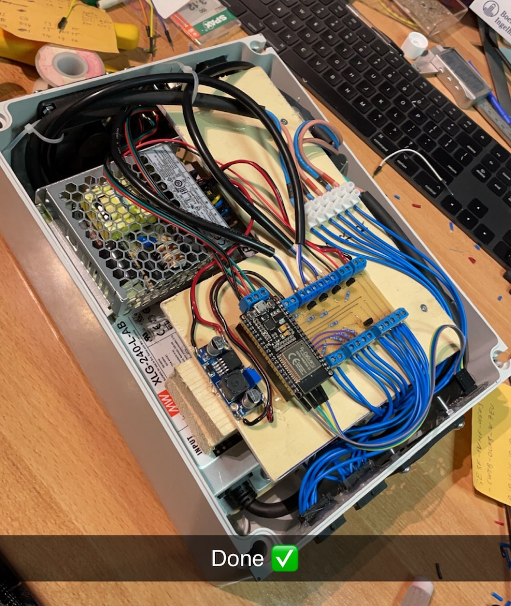

# High Power RGB LED control

I got my hands on some high power (~800W) RGB LED modules used in stage lightning applications.
Sadly, I just got the LED modules without any driver circuit (but luckily with the cooling units),
so I had to reverse-engineer all the electronic details.

There was one big LED chip (~8x8cm) per color with two times 44 LEDs in series. The three chips were
mounted on three sides of a prism-like mirror case which redirected the light all into one direction
using color-spectrum and angle-of-irradiation dependent mirrors. No idea if I explained this
correctly, I not a physicist :D Anyway, impressive engineering!

### 300V? What?

At 700mA forward current, one (green) LED took around 3.1V. For 44 LEd, this would sum up to ~140V.
As I didn't want to build / buy six drivers, I modified the PCB and put all the 88 LEDS in series.
Dang, now I need ~280V to drive them :D.

Luckily, there is Meanwell. To be precise, the `XLG-240-L-AB`. A (up to) 370V constant power
dimmable LED driver. Awesome! So I bought three of them.

### Cooling

So the only thing left was to build something PWM controlling the XLGs, right? Nope :D You cannot
put 800 Wats of power into an LED without cooling. Without active cooling. Thankfully, the LED
module already contained big heat sinks with PWM controllable 24V fans. And after some research, I
even found NTCs on every LED module. And nobody likes fan noise if you don't need it. So,
temperature dependant fan control, please!

### Control

But how to control the colors now? Web UI? DMX? Art-Net? All! Thankfully, there are already some
cool libs to talk to [DMX](https://github.com/someweisguy/esp_dmx)
and [Art-Net](https://github.com/rstephan/ArtnetWifi). Using those two libs, the system can even
translate Art-Net to DMX and vice versa. Always taking ch 1-3 as RGB input.

### Electronics

In the end, it looks like this:

### Outlook

As the original stagelight is a moving head with gobos etc, this would be the next step. But I have
to wait until I get my hands on a broken one (with intact mechanics) to built that... Project for
another winter :)